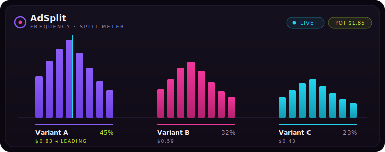

# AdSplit — pre-launch creative test, settled in real money

A media-buyer's test plan, run on-chain. Put two to four ad creatives in front of a crowd, let them put cents behind the variant that actually hooks them, and read the winner *before* a single dollar of campaign budget gets spent. The variant that pulls the most money is the variant you scale.

<p align="center">
  
</p>

```
Objective    Pick the winning creative before the campaign spends real budget.
Hypothesis   A small real-money stake from many viewers predicts the high-CTR variant
             faster and cheaper than a week of paid traffic.
Method        Open a battle of 2–4 variants. Viewers stake $0.05–0.20 USDC on one.
             At deadline the full pot is paid to the winning variant's author.
KPI          Pot share per variant (the live read). Cost to run a test: one settle tx.
```

- Live: https://adsplit-arc.vercel.app
- Contract `0xD72527099590782dF705283997f060EdA008cfAf` — verified on Arc testnet (chain `5042002`). Source: [`contracts/AdSplit.sol`](contracts/AdSplit.sol) · [view on ArcScan](https://testnet.arcscan.app/address/0xD72527099590782dF705283997f060EdA008cfAf)

---

## Test setup

You launch a **battle** and load it with 2–4 creatives. Each creative is a **variant** — a label and an image. On-chain that is one call:

```
createBattle(string title, string[] labels, string[] images, uint64 durationSecs)
```

Guardrails the contract enforces: 2–4 variants (`MIN_VARIANTS`/`MAX_VARIANTS`), a title up to 80 chars, and a voting window between `5 minutes` and `7 days`. In v1 every variant's author is you, the buyer running your own creative set — so a winning payout returns the whole pot to the person who funded the test.

Image hosting goes through Vercel Blob when `BLOB_READ_WRITE_TOKEN` is set; without it, the create form accepts a pasted image URL. Either way the contract only stores a string URL, capped at 256 chars.

## Reading the result

This is the part that replaces a week of waiting on a paid-traffic test. While a battle is open, anyone auditions the variants and backs one:

```
stake(uint256 id, uint8 variant) payable
```

The stake **is** `msg.value` — native USDC moves in the same transaction, no token approval step, one tap. Per-stake bounds are `MIN_STAKE = 0.05` and `MAX_STAKE = 1` USDC (the UI offers chips at $0.05 / $0.10 / $0.15 / $0.20). Every stake updates each variant's share of the pot, and that share is your read: the split *before* launch is the forecast. Back the creative the crowd already put its own money behind, not the one that tested well in a meeting.

`leaderState(id)` returns the live tally an analyst (or an agent — see below) needs: the leading index, a tie flag, and the staked amount per variant.

## Payout

When the window closes, the battle gets finalized:

```
settle(uint256 id)
```

- Winner = the variant holding the most staked USDC. The **entire pot** is credited to that variant's author. No platform cut, no listing fee, no skim — the pot in equals the payout out.
- A **tie for first**, or a battle that took **zero stakes**, voids. Nobody wins and every staker reclaims exactly what they put in.

Money never auto-transfers on settle — payouts are **pull-based** so a single reverting recipient can't jam a battle:

- `withdraw()` — a winning author pulls their accumulated winnings (tracked in `owed[address]`).
- `refund(id, variant)` — on a voided battle, each staker pulls back their own stake per variant.

`settle()` itself does pure accounting and makes no external call, which is why anyone can run it and no one can block it. `cancelBattle(id)` lets a creator scrap a battle *only* while it holds no stakes — the contract is powerless over money that's already in play.

Lifetime counters are public: `battleCount`, `totalStaked`, `totalPaid`, `settledCount`.

## Agent signal (x402)

Two pieces of automation ship in this repo, both real and both honest about their scope.

**Keeper** — [`agent/keeper.mjs`](agent/keeper.mjs) is a standalone Node script. Point it at the contract with a funded Arc wallet (`AGENT_PRIVATE_KEY`, `CONTRACT`) and it polls battle deadlines, calling `settle()` the moment a window closes so winning authors are paid machine-to-person. Because `settle()` is permissionless, the keeper is a convenience, not a trust anchor — if it's offline, the "Settle now" button (or any wallet) finalizes the battle just the same.

**Agent signal over x402** — [`app/api/x402/signal/[id]/route.ts`](app/api/x402/signal/[id]/route.ts) is a live server route that speaks the real x402 (HTTP `402 Payment Required`) handshake. An ad-buying agent that wants a battle's live read pays a `0.01 USDC` micropayment, then GETs `/api/x402/signal/{id}` to receive the leader, the per-variant split, and the pot — and front-loads campaign budget toward the winner before traffic runs.

Honest scope: Arc's USDC is the **native** 18-decimal coin, so there's no ERC-20 `exact`/EIP-3009 gasless flow. The route uses **pay-then-prove** — the client sends native USDC to the agent wallet (`AGENT_WALLET`) and carries the tx hash in the `X-PAYMENT` header; the server verifies it on-chain (right recipient, amount `10000000000000000` wei, confirmed, within a 120-second freshness window), returns the signal with an `X-PAYMENT-RESPONSE` header, and rejects a reused hash. It's self-verified with no facilitator — a faithful testnet implementation, not facilitator-settled EIP-3009. The matching client is a demo: [`agent/signal-demo.mjs`](agent/signal-demo.mjs).

## Why Arc is load-bearing here

The whole pitch is *cheaper signal than buying traffic*. That math only survives if the per-unit cost of collecting signal stays near zero:

- A pre-launch test wants **many small votes**, not a few big ones. Stakes of five to twenty cents are the entire instrument. On a chain where a transaction fee rivals the stake, every vote is taxed into noise and the experiment is dead before it starts. Arc settles native USDC sub-second and cheap enough that a $0.05 stake is a $0.05 stake.
- The payout is **winner-take-all of the actual pot**. If settlement skimmed gas off the top, the winning author wouldn't receive what the crowd staked, and the "real money" signal would be a lie. Native USDC in, native USDC out, no wrapped-token detour.
- The signal is only useful if **software can act on it the instant it's decisive**. A permissionless `settle()` and a programmatic x402 read mean an autonomous buyer can pay cents for the leader and reallocate budget the same minute — no human in the settlement loop, no custody.

Spend cents to learn which creative converts; spend the budget only on the one that already won.

## Run it locally

```bash
npm install
npm run dev          # http://localhost:3000
```

The keeper and x402 route read `AGENT_WALLET` / `AGENT_PRIVATE_KEY` (and optionally `ARC_RPC`, `POLL_MS`) from the environment — never committed. Without `AGENT_WALLET` the signal route returns `503` rather than pretending to take payment.

---

Run the test in public, in real money, before the campaign goes live — and let the pot tell you which creative to scale.
